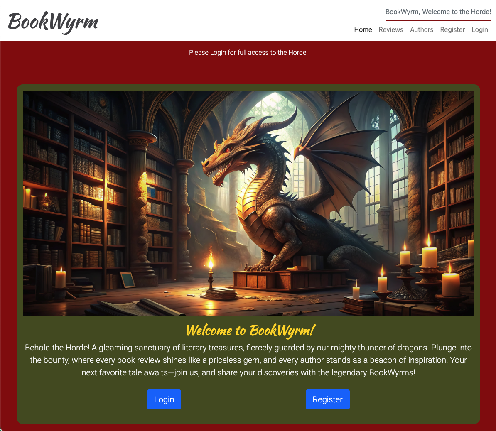

# BookWyrm

BookWyrm is a website created for avid readers to post and share information about their favourite books and authors. All under the protection of dragons.

The main objective of the site is to create a space where users can share the stories and authors they love with a wider community. This is achieved through the publishing of reviews and author bios.

Visit the deployed site [here](https://bookwyrm-f93c738e909e.herokuapp.com/)

## Table of Contents

1. [User Experience (UX)](#user-experience-ux)
    1. [Strategy](#strategy)
        1. [Project Goals](#project-goals)
        2. [User Goals](#user-goals)
        3. [Strategy Table](#strategy-table)
    2. [Scope](#scope)
        1. [User Stories](#user-stories)
    3. [Structure](#structure)
    4. [Skeleton](#skeleton)
    5. [Surface](#surface)
2. [Features](#features)
    1. [General](#general)
    2. [Home Page](#home-page)
    3. [Reviews Page](#reviews-page)
    4. [Authors Page](#authors-page)
    5. [Book Review Page](#book-review-page)
    6. [Author Bio Page](#author-bio-page)
    7. [Add Review Page](#add-review-page)
    8. [Edit Review Page](#edit-review-page)
    9. [Delete Review Prompt](#delete-review-prompt)
    10. [Add Author Page](#add-author-page)
    11. [Edit Author Page](#edit-author-page)
    12. [Delete Author Prompt](#delete-author-prompt)
    13. [Authentication Pages](#authentication-pages)
    14. [404 Page](#404-page)
3. [Technologies Used](#technologies-used)
    1. [Languages Used](#languages-used)
    2. [Libraries and Frameworks](#libraries-and-frameworks)
    3. [Packages / Dependencies Installed](#packages-dependencies-installed)
    4. [Database Management](#database-management)
    5. [Tools and Programs](#tools-and-programs)
4.  [Testing](#testing)
    1. [Go to TESTING.md]()
