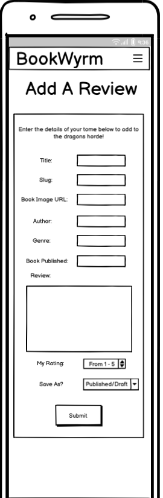
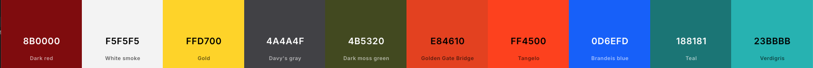
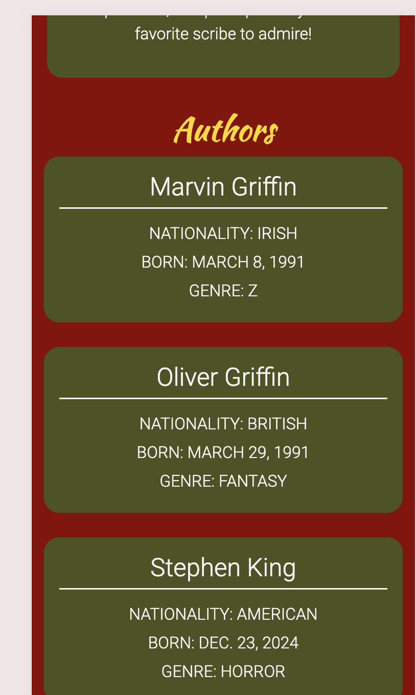
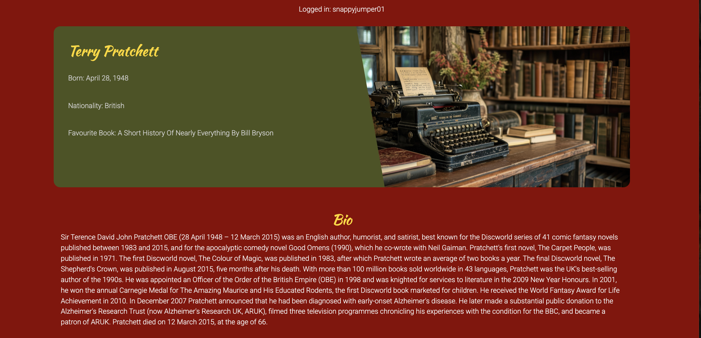
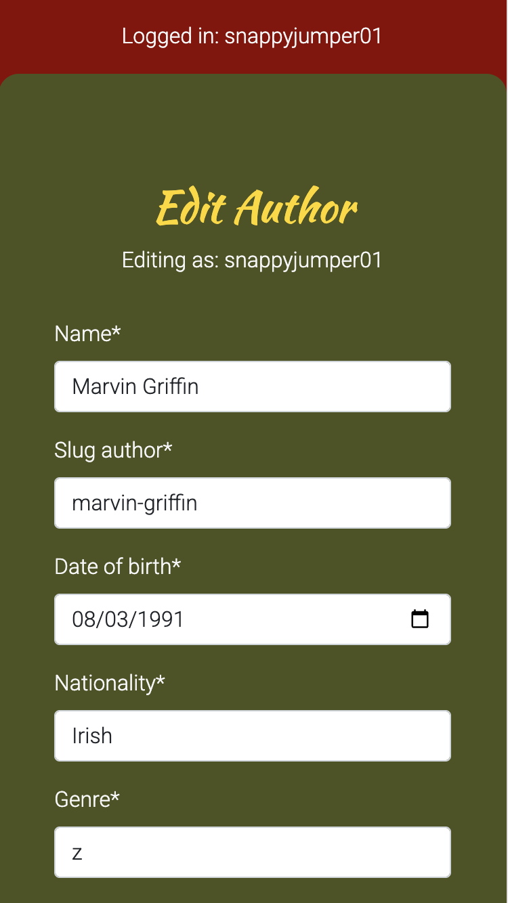
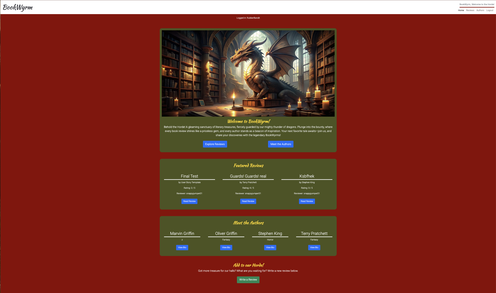
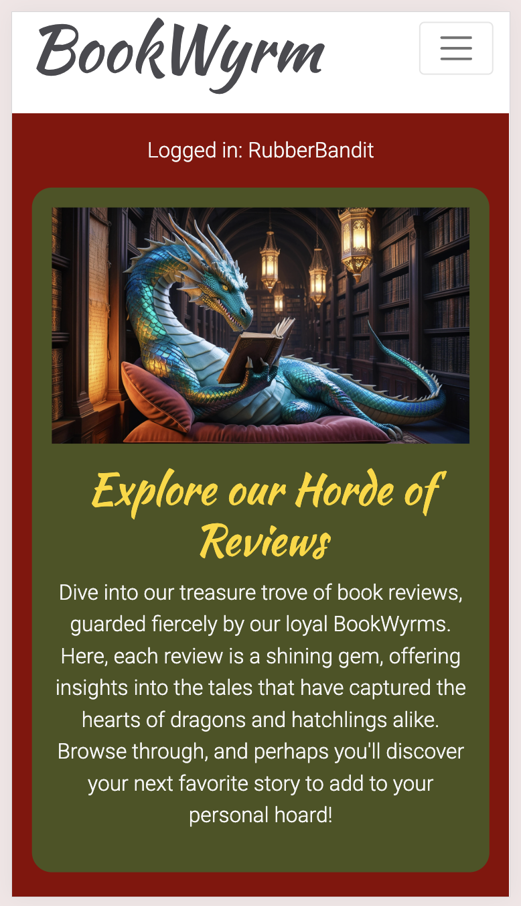
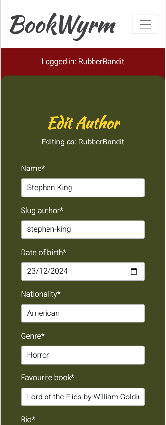

# BookWyrm

BookWyrm is a website created for avid readers to post and share information about their favourite books and authors. All under the protection of dragons.

The main objective of the site is to create a space where users can share the stories and authors they love with a wider community. This is achieved through the publishing of reviews and author bios.

Visit the deployed site [here](https://bookwyrm-f93c738e909e.herokuapp.com/)

## Table of Contents

1. [User Experience (UX)](#user-experience-ux)
    1. [Strategy](#strategy)
        1. [Project Goals](#project-goals)
        2. [User Goals](#user-goals)
        3. [Strategy Table](#strategy-table)
    2. [Scope](#scope)
        1. [User Stories](#user-stories)
    3. [Structure](#structure)
    4. [Skeleton](#skeleton)
    5. [Surface](#surface)
2. [Features](#features)
    1. [General](#general)
    2. [Home Page](#home-page)
    3. [Reviews Page](#reviews-page)
    4. [Authors Page](#authors-page)
    5. [Book Review Page](#book-review-page)
    6. [Author Bio Page](#author-bio-page)
    7. [Add Review Page](#add-review-page)
    8. [Edit Review Page](#edit-review-page)
    9. [Delete Review Prompt](#delete-review-prompt)
    10. [Add Author Page](#add-author-page)
    11. [Edit Author Page](#edit-author-page)
    12. [Delete Author Prompt](#delete-author-prompt)
    13. [Authentication Pages](#authentication-pages)
    14. [404 Page](#404-page)
    15. [Base Template Messages](#base-template-messages)
3. [Technologies Used](#technologies-used)
    1. [Languages Used](#languages-used)
    2. [Libraries and Frameworks](#libraries-and-frameworks)
    3. [Packages / Dependencies Installed](#packages-dependencies-installed)
    4. [Database Management](#database-management)
    5. [Tools and Programs](#tools-and-programs)
4.  [Testing](#testing)
    1. [Go to TESTING.md](https://github.com/SnappyJumper/BookWyrm/blob/main/TESTING.md#bookwyrm-testing)
5. [Deployment](#deployment)
6. [Finished Product](finished-product)
7. [Credits](#credits)
8. [Known Bugs](#known-bugs)
9. [Acknowledgements](#acknowledgements)

***

## User Experience (UX)

### Strategy

### Project Goals

* The website contains rich colors to go with the theme of dragons, whilst also not drawing away from the content too much.

* It has a responsive design so its accessable across a range of screen sizes.

* Structure is easy to navigate and understand.

* Site Users can login or register to fully interact with the site contents.

* Site Users can leave reviews about the authors posted on the site.

* Site Users can add bios about their favourite authors and post them to the site.

### User Goals

* As a Site Admin, I want to be able to manage the content of the site.

* As a Site User, I want to be able to interact with the content on the site.

* As a Site User, I want the information provided by the site to be simple to understand and easy to navigate.

* As a Site User, I want to be able to create and manage my content.

#### Strategy Table

Issue | Importance | Viability / Feasibility
--- | --- | ---
Responsive design | 5 | 5
User registration | 5 | 5
Create, edit and delete Authors | 5 | 4
Create, edit and delete Reviews | 5 | 4
Saving reviews and authors as drafts | 5 | 4
Adding profile pictures for users | 3 | 2
Commenting on other users content | 3 | 2
Social Media registration | 3 | 2
Ability to search for reviews | 3 | 2
Have a community rating system for book entries | 2 | 2
**Total** | **39** | **32**

### Scope

When reviewing the strategy table it is clear that not all features can be implemented in the first release of the project. In this case the project will be released in phases. The first phase will consist of features identified to build the minimul viable product.

**First Phase**

* Responsive design

* Account registration

* Create, edit and delete Authors

* Create, edit and delete Reviews

* Save un-published content as a draft 

**Second Phase**

* Commenting on other users content

* Adding profile pictures for users

* Social Media registration

* Ability to search for reviews

**Future Phases**

*  Have a community rating system for book entries

### User Stories

GitHub projects was used as my project management tool to track user stories. Using the Kanban board helped me to better visualise the scope of the project and get tasks completed in an organised manner.

### Structure

The website has a Hierarchial Tree Structure so that navigation through the site is effortless. Here is a sketch of the structure made using [miro](https://miro.com/).

* The header, footer and nav bar remain consistent across all pages.

* Links and forms provide feedback to the Site User.

* Once the User us logged in or registered they are given greater access to the site.

* A custom 404 page has also been implemented.

#### Database Model

The databade model was designed using [drawsql](https://drawsql.app/). The type of database being used is a relational PostgreSQL database supplied by [Code Institute](https://dbs.ci-dbs.net/)

The database model was designed before the project with a larger scope in mind. For this MVP release I will discuss the models that have been implemented. The others will be added at a later phase.

**Book Model**

* Title: Unique book title provided by the review's author.

* Slug: Stores a unique slug to identify the review by.

* Author: Stores the Author of the book being reviewed as a Author Foreign Key.

* Genre: Stores the genre of the book.

* Book_published: Stores the date the book was published set by the review's author.

* Review: Review details provided by the review's author.

* Rating: A rating out of 5 for the book provided by the review's author

* Status: Review author provides the status so the review is either published or a draft.

* Review_author: Stores the author of the review as a User Foreign Key.

* Created_on: Date and time set when review is created

**Author Model**

* Name: Unique author name provided by the bio's author.

* Slug_author: Stores a unique slug to identify the author by.

* Date_of_birth: Stores the date the author was born supplied by the author of the bio.

* Nationality: Stores author's nationality supplied by bio's author.

* Genre: Stores the authors writting genre supplied by the bio's author.

* Favourite_book: Stores the author's favoutite book supplied by the bio's author.

* Bio: Author bio details suppplied by the bio's author.

* Status: Bio's author proved the status to determine wether to publish bio or save as a draft.

Posted_by: Stores the author of the bio as a User Foreign Key.

### Skeleton

#### Wireframes

[Balsamiq](https://balsamiq.com/) was used to help build the appearance of the site and display the placement of different elements in the pages. As the development of the project progressed some of the ideas in the wireframes were altered or abandoned so the wireframes differ from the final product.

Page | Desktop | Mobile
--- | --- | ---
Index |  | 
login |  | 
Reviews |  | 
Authors |  | 
Review |  |  
Author |  | 
Add / Edit Author |  | 
Add / Edit Review |  | 
Add / Edit Comment |  | 

### Surface

#### Color Scheme

The colors used in the website are a dark red (#8B0000) for the main background and white smoke (#F5F5F5) for the header background and body text. Gold (FFD700) was used for subtitles and Davy's Grey (#4A4A4F) for the brand and alert text. Dark moss green (#4B5320) was used for the content boxes whereas golden gate bridge (#E84610), tangelo(#FF4500), brandeis blue (0D6EFD) , teal (188181) and verdigris (23BBBB) were used to style numerous buttons and links thoughout the site.

These colors were chosen because of their warmth and richness. They also match golds, greens and reds of dragons which suit the sites theme.

#### Typograpy

The main font used in the site is Roboto, with a sans-serif fall back in case of import errors. The font used on the brand and titles throughout the website is Kaushan Script with a serif fall back incase if import errors.

The Kaushan Script was chosen because it suited the theme of the site and Roboto is a script that reads well for content.

[Back to top ⇧](#bookwyrm)

## Features

### General

* The website was designed with mobile first in mind.

* The design is responsive across all devices.

* Navigation Bar:
    * Desktop:
    

    * Mobile:
    

    * Contains the site brand.

    * Contains the links to other areas of the site with the current page highlighted.

    * Collapses into a burger bar button when viewed on smaller devices.

* Footer
    * 

    * Footer displays the site creators username and some links to socials.

### Home Page

* Featured Reviews and Authors List

    * Desktop:
    

    * Mobile:
    
    

    * Displays a list of 4 featured reviews and 3 featured authors and some relevant info to engage the User.

    * Provides a button below each to take the User to the author or review.

    * For un-registered Users buttons display to encourage you to login or sign up in both the welcome field and at the bottom of the page.

    * For registered Users buttons replace the login or sign up prompts encouraging you to explore reviews and authors in the welcome field and at the bottom of the page to add a review.

### Reviews Page

* Reviews List:

    * Desktop:
    

    * Mobile:
    

    * Displays a paginated, responsive list of all the reviews and some relative info to engage the User.

    * Provides the user with a link in the title to the detailed review.

    * For logged in Users there is a section for their saved drafts so they can view them before final editing and publishing.

    * User is encouraged to add more reviews when logged in via a button at the bottom of the page.

### Authors Page

* Authors List:

    * Desktop:
    

    * Mobile:
    

    * Displays a paginated, responsive list of all the authors and some relative info to engage the User.

    * Provides the user with a link in the name to the detailed bio.

    * For logged in Users there is a section for their saved drafts so they can view them before final editing and publishing.

    * User is encouraged to add more authors when logged in via a button at the bottom of the page.

### Book Review Page

* Book Instance:

    * Desktop:
    

    * Mobile:
    

    * Displays a responsive instance of the Book Model for the User to view.

    * Logged in Users who created the instance can edit or delete it via two buttons in the masthead.

    * The Review itself is delivered in a rich text format.

### Author Bio Page

* Author Instance:

    * Desktop:
    

    * Mobile:
    

    * Displays a responsive instance of the Author Model for the User to view.

    * Logged in Users who created the instance canedit or delete it via two buttons in the masthead.

    * The review itself is delivered in a rich text format.

### Add Review Page

* Add Review Form:

    * Desktop:
    

    * Mobile:
    

    * Renders a responsive form for the logged in User to add their own review to the site.

### Edit Review Page

* Edit Review Form:

    * Desktop:
    

    * Mobile:
    

    * Renders a responsive form for the logged in and authenticated User. It is pre-filled with the content being edited.

### Delete Review Prompt

* Delete Prompt:

    * Prompt:
    

    * Calls a JavaScript function which displays a confirmation prompt before deletion.

    * Prevents accidental deletion and improves User
    experience.

### Add Author Page

* Add Author Form:

    * Desktop:
    

    * Mobile:
    

    * Renders a responsive form for the logged in User to add their own author bio to the site.

### Edit Author Page

* Edit Author Form

    * Desktop:
    

    * Mobile:
    

    * Renders a responsive form for the logged in and authenticated User. It is pre-filled with the content being edited.

### Delete Author Prompt

* Delete Prompt:

    * Prompt:
    

    * Calls a JavaScript function which displays a confirmation prompt before deletion.

    * Prevents accidental deletion and improves User
    experience.

### Authentication Pages

Page | Purpose | Image
--- | --- | ---
Login | Allows registered User to login to account on site. |  
Sign Up | Allows un-registered Users to create an account on the site. | 
Logout | Allows registered Users to log out of their accounts. | 

### 404 Page

* Custom 404 Page:

    * Page:
    

    * A custom 404 page to suit the theme.

    * Has a Home button to redirect lost Users back to safety.

### Base Template Messages

* The base.html file, from which all templates inherit from, contains a place for messages. These messages are success and error messages depending on the action that a user is trying to perform. See some examples in the table below.

Action | Resulting Message
--- | ---
Successfully Login | 
Successfully Logout | 
Successfully Post Content | 
Unauthorised Access To Edit | 
Unauthorised Viewing of Draft | 

* The success messages help Users to confirm that what they have just done has been applied.

* The error messages inform unauthorised users why they have been diverted away from the content they were trying to reach.

* These messages are both informing and improve the experience of the User.

[Back to top ⇧](#bookwyrm)

## Technologies Used

### Languages Used

* [HTML5](https://en.wikipedia.org/wiki/HTML)
* [CSS3](https://en.wikipedia.org/wiki/CSS)
* [JavaScript](https://en.wikipedia.org/wiki/JavaScript)
* [Python](https://en.wikipedia.org/wiki/Python_(programming_language))

### Libraries and Frameworks

* [Django](https://www.djangoproject.com/)   
    * Django was used as web framework.

* [Django Template](https://jinja.palletsprojects.com)  
    * Django Template was used as a templating language for Django to display backend data to HTML.
   
* [Bootstrap 5](https://getbootstrap.com/docs/5.0/getting-started/introduction/)  
    * Bootstrap 5 was used throughout the website to help with styling and responsiveness.

* [Google Fonts](https://fonts.google.com)  
    * Google fonts was used to import the fonts into the html file, and were used on all parts of the site.

* [Font Awesome](https://fontawesome.com)  
    * Font Awesome was used throughout the website to add icons for aesthetic and UX purposes. 

### Packages / Dependencies Installed

* [Django Allauth](https://django-allauth.readthedocs.io/en/latest/)  
    * Django Allauth was used for user authentication, registration, and account management.

* [Django Crispy Form](https://django-crispy-forms.readthedocs.io/en/latest/)   
    * Django Crispy Form was used to control the rendering of the forms. 
 
* [Gunicorn](https://gunicorn.org/)  
    * Gunicorn was used as Python WSGI HTTP Server for UNIX to support the deployment of Django application.  

* [Summernote](https://summernote.org/) 
    * Summernote has been used to provide rich text content to the admin and User.

* [Dj-database-url](https://pypi.org/project/dj-database-url/) and [Psycopg2](https://pypi.org/project/psycopg2/)
    * They both were used to help connect the database.

* [WhiteNoise](https://whitenoise.readthedocs.io/en/latest/)
    * Used to serve Static files for Heroku

### Database Management

* [Code Institute PostgreSQL](https://dbs.ci-dbs.net/)
    * Used to manage my database supplied by Code Institute

### Tools and Programs

* [Git](https://git-scm.com)  
    * Git was used for version control by utilizing the Gitpod terminal to commit to Git and Push to GitHub. 

* [GitPod Enterprise](https://gitpod.io/)
     * GitPod Enterprise was used for writing code, committing, and then pushing to GitHub.

* [GitHub](https://github.com)  
   GitHub was used to store the projects code after being pushed from Git. 

* [Heroku](https://www.heroku.com)   
    * Heroku was used to deploy the website.

* [Coolors](https://coolors.co)  
    * Coolors was used to create a color scheme for the website.

* [Image Compressor](https://imagecompressor.com/)    
    * Image Compressor was used to reduce the file size of the images.

* [Balsamiq](https://balsamiq.com/)
     * Balsamiq was used to create the wireframes during the design phase of the project

* [Chrome DevTools](https://developer.chrome.com/docs/devtools/)
    * Chrome DevTools was used during development process for code review and to test responsiveness.

* [W3C Markup Validator](https://validator.w3.org/)
    * W3C Markup Validator was used to validate the HTML code.

* [W3C CSS Validator](https://jigsaw.w3.org/css-validator/)
    * W3C CSS Validator was used to validate the CSS code.

* [JSHint](https://jshint.com/) 
    * The JSHints JavaScript Code Quality Tool was used to validate the site's JavaScript code.

* [CI Python Linter](https://pep8ci.herokuapp.com/) and [Pylint](https://pypi.org/project/pylint/)
    * The CI Python Linter and Pylint were used to help validate the Python code.

* [miro](https://miro.com/)
    * Miro was used to visualise the website flow.

* [drawsql](https://drawsql.app/)
    * Drawsql was used to visualise the database models.

* [Favicon.cc](https://www.favicon.cc/) 
    * Favicon.cc was used for icons on the site.

[Back to top ⇧](#bookwyrm)

## Testing 

All testing documentation can be found [here](https://github.com/SnappyJumper/BookWyrm/blob/main/TESTING.md#bookwyrm-testing)

[Back to top ⇧](#bookwyrm)

## Deployment

This project was developed using a [GitPod](https://gitpod.io/) Enterprise workspace. The code was commited to [Git](https://git-scm.com/) and pushed to [GitHub](https://github.com/") using terminal commands.

## Deploying on Heroku
To deploy this project to Heroku from its GitHub repository, the following guidelines were followed:

1. Login to your account:
    - Select login and fill in your details.
    - Navigate to the apps page.

2. Create the Heroku App:
    - Select "Create new App" from the "New" dropdown on the top right of the screen. 
    - Choose a name for your app and select your location.

3. Set the CONFIG VARS:
    - Once the app is loaded click the settings tab.
    - Click Reveal Config Vars.
    - Set The following keys and values:
    KEY | Value
    --- | ---
    DATABASE_URL | "URL Provided by Code Institute PostgreSQL"
    SECRET_KEY | "Your Django Projects Secret key value"
 
4. Prepare the environment and settings.py file:
    - In the Settings tab, click on Reveal Config Vars and copy the url next to DATABASE_URL.
    - In your GitPod workspace, create an env.py file in the main directory. 
    - Add the DATABASE_URL value and your chosen SECRET_KEY value to the env.py file.
    - Add the SECRET_KEY value to the Config Vars in Heroku.
    - Update the settings.py file to import the env file and add the SECRETKEY and DATABASE_URL file paths.
    - In settings.py add the following sections:
        - STATICFILE_STORAGE
        - STATICFILES_DIRS
        - STATIC_ROOT
        - MEDIA_URL
        - DEFAULT_FILE_STORAGE
        - TEMPLATES_DIR
        - Update DIRS in TEMPLATES with TEMPLATES_DIR
        - Update ALLOWED_HOSTS with ['app_name.heroku.com', 'localhost']

5. Collect Static Files and Deploy to Heroku:
    - Type python3 manage.py collectstatic into the terminal.
    - Create a "Procfile" in the main directory and add the following line:
        - web: gunicorn bookwyrm.wsgi
    - Go to the deploy tab and connect heroku to your projects GitHub repository.
    - Click on deploy branch and wait until the build is complete. Once complete the app can then be accesed via the view button.

[Back to top ⇧](#bookwyrm)

## Finished Product

Page | Desktop | Mobile |
--- | --- | --- |
| Home |  |  |
| Reviews |  |  |
| Authors |  |  |
| Review |  |  |
| Author Bio |  |  |
| Add Review |  |  |
| Add Author |  |  |
| Edit Review |  |  |
| Edit Author |  |  |
| Signup |  |  |
| Login |  |  |
| Sign Out |  |  |
| Custom 404 |  |  |