# BookWyrm Testing

[Back to the README.md file](https://github.com/SnappyJumper/BookWyrm/blob/main/README.md)

[Back to the Testing section of the README.md file](https://github.com/SnappyJumper/BookWyrm/blob/main/README.md#testing)

View the deployed site [here](https://bookwyrm-f93c738e909e.herokuapp.com/)

## Table of Contents

1. [Testing User Stories](#testing-user-stories)
2. [Code Validation](#code-validation)
3. [Accessibility](#accessibility)
4. [Tools Testing](#tools-testing)
5. [Manual Testing](#manual-testing)

***

## Testing User Stories

The missing user stories were not set for completion in the first phase release of the project.

### 1. As a logged in Site User I can create a Book Review so that I can share it with other Site Users

* A login feature was provided so Users can login to their own profiles.

* Once logged in a User has access to the Add Review Form and can create their own review.

* The User can then share their review on the site by saving it as published.

* The User can also save their review as a draft to return to later before publishing.

### 2. As a Site User I can edit my pre-existing Book Reviews so that I can improve its quality post publishing

* Once the User has published a review they can return any time to edit it.

* The User gets brought to the Edit Review Form and finds it prefilled with their content ready to be edited.

* The User can then choose to publish the content once their editing is complete or save it as a draft to return to later. 

* Only a logged in User who owns the review can edit it.

### 3. As a Site User I can delete my published reviews which will lead to a more positive user experience.

* Once a review has been published the User can return at any time to delete it.

* Only the User who created the review can choose to delete it.

* When the authorised User decides to click delete they are prompted by the site to get confirmation before deletion.

### 4. As a logged in Site User I can create a Bio for a book Author which I can share with other Site Users

* When a User has completed registration or logged in they can access the Add Author Form and create their own author bio.

* The User can then share their author bio on the site or save it as a draft before publishing.

### 5. As a Site User I can edit my published Author Pages so I can improve their quality post-publishing.

* Once the User has published an author bio they can return at any time to edit it.

* The User gets brought to the Edit Author Form and finds it prefilled with their content ready to be edited.

* The User can then choose to publish the content once their editing is complete or save it as a draft to return to later.

* Only a logged in User who owns the author bio can edit it.

### 6. As a site User I can delete my published Author Pages which will lead to a more positive user experience

* Once an author bio has been published te User can return at any time to delete it.

* Only the User who created te author bio can choose to delete it.

* When the authorised User decides to click on delete they are prompted by the site to get confirmation before deletion.

### 13. As a registered User I would like to be able to log in and out as I please which would improve my user experience.

* A registered User can log in to the site by selecting the option in the navigation bar.

* Here the registered User can enter their account information to access their account.

* Once logged in the options in the navigation bar cange and the User can access the log out option.

* Here they are prompted by the page to confirm they wish to logout by pressing a sign out button.

* Once pressed the User is signed out again.

### 14. As a logged in User I would like to see that I am logged in and be able to perform additional functions as a logged in User, this would improve my user experience and my interactions with the site.

* Once the User is logged in they are redirected to the home page where a sign in confirmation displays at the top of the page.

* The User will now see their username displayed as logged in at the top of each page.

* Once logged in the User has access to create, edit and delete their own reviews and author bios.

### 15. As a User I wouls like to be given the opportunity to register to the site , so that I can begin creating my own content and interact with the site more.

* An unregistered User can see an option within the navigation bar which allows them to access the sign up page.

* Here the unregistered User can fill in a form to secure an account on the site.

* Once they have created their account the User has access to create, edit and delete their own reviews and author bios.

## Code Validation

### HTML

The [W3C Markup Validator](https://validator.w3.org/) service was used to validate the HTML code of the project.

You'll find the validations for each page in the table below:
Page | Initial Validation | After Corrections(If applicable)
--- | --- | ---
Home | 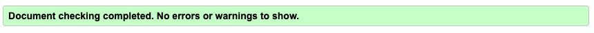 | N/A
Reviews | 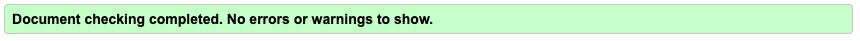 | N/A
Authors | 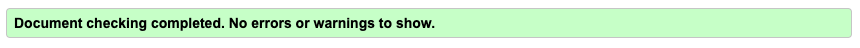 | N/A
Review |  | 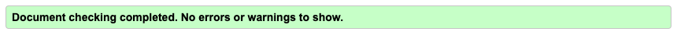
Author Bio | 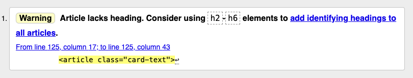 | 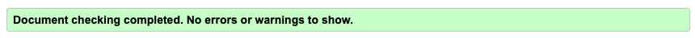
Add Review |   | Corrections were not required as these validation errors are with the summernote package and I cannot access them to change them.
Add Author | 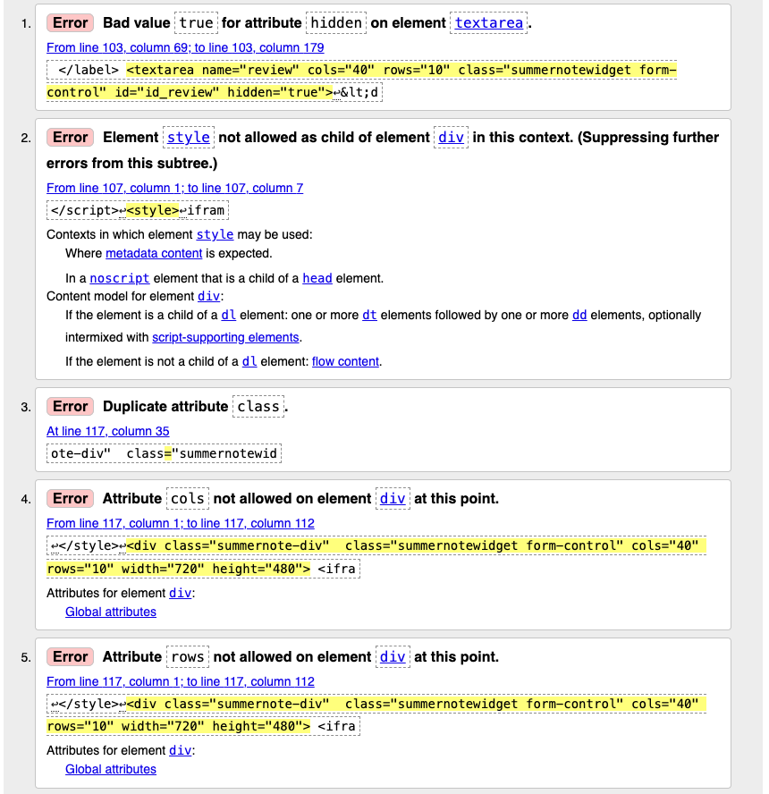 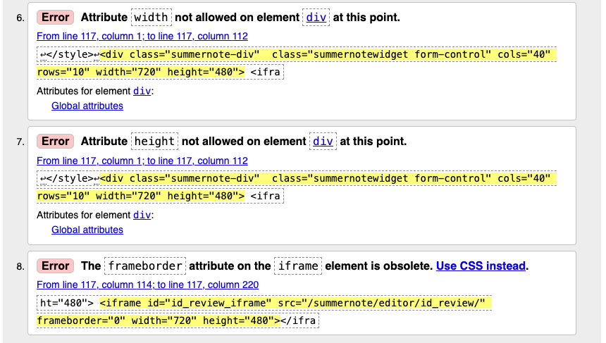 | Corrections were not required as these validation errors are with the summernote package and I cannot access them to change them.
Edit Review | 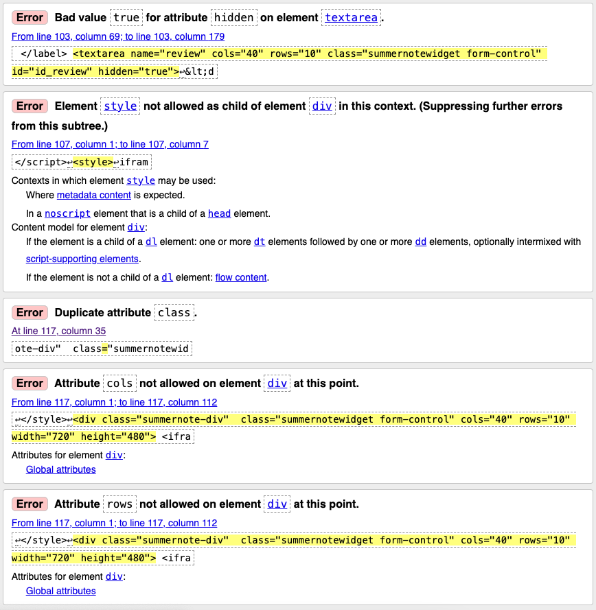 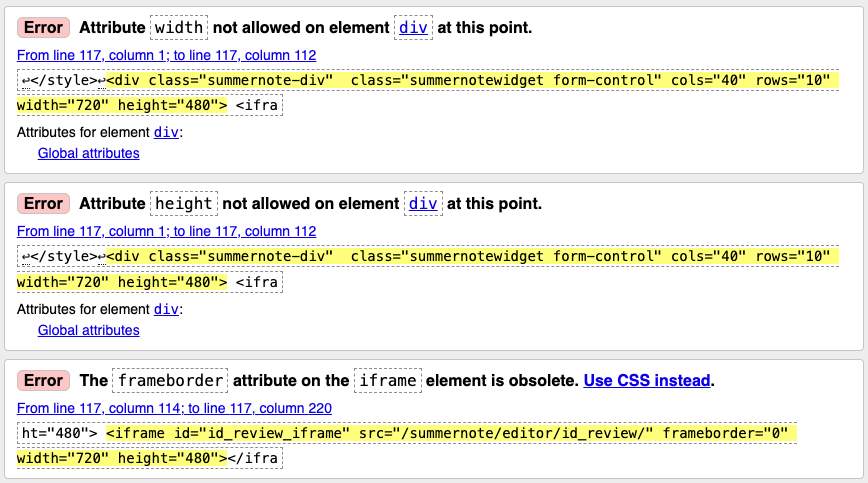 | Corrections were not required as these validation errors are with the summernote package and I cannot access them to change them.
Edit Author | 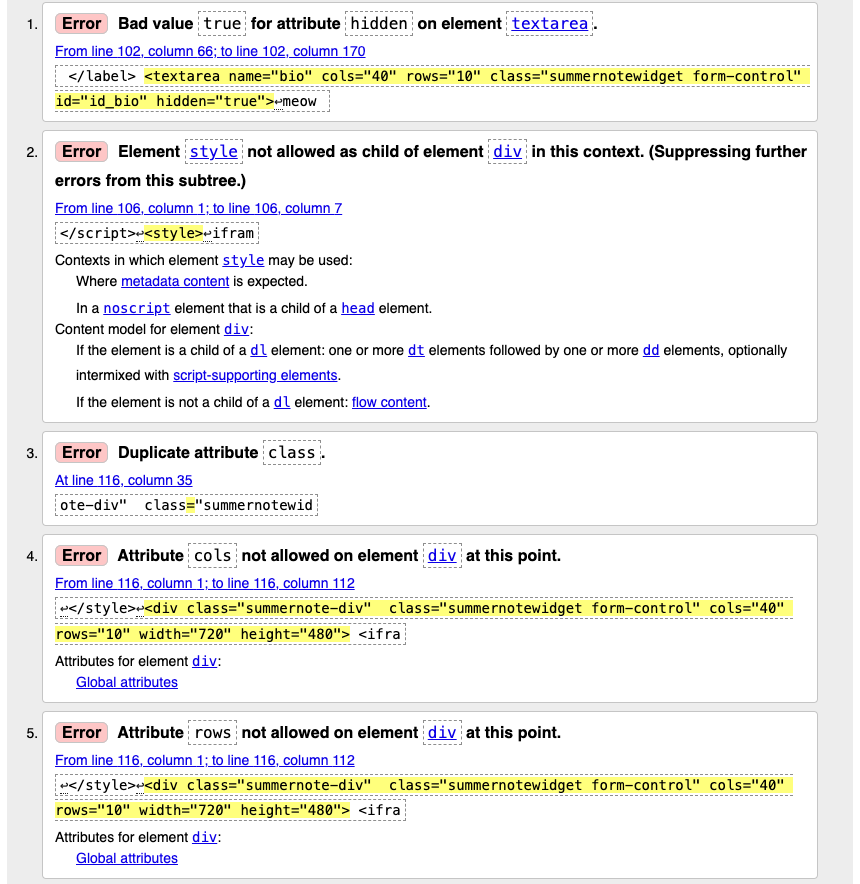  | Corrections were not required as these validation errors are with the summernote package and I cannot access them to change them.
Signup | 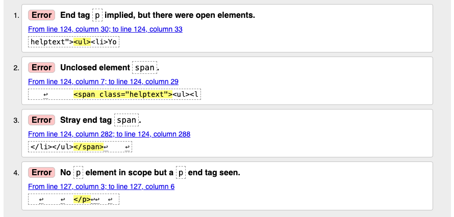 | 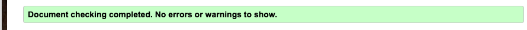
Login |  | N/A
Sign Out | 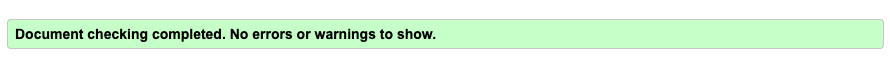 | N/A
Custom 404 | 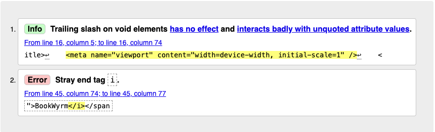 | 

### CSS

The [W3C CSS Validator](https://jigsaw.w3.org/css-validator/) was used to validate the css in my Styles.css sheet.

My CSS passed the validator check

