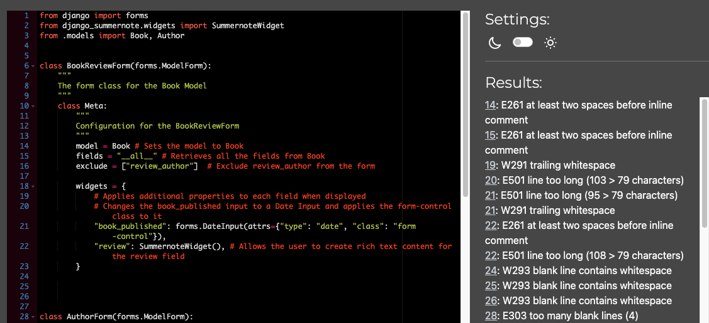
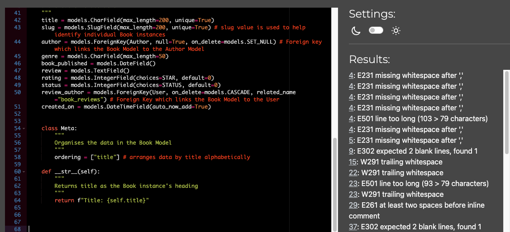
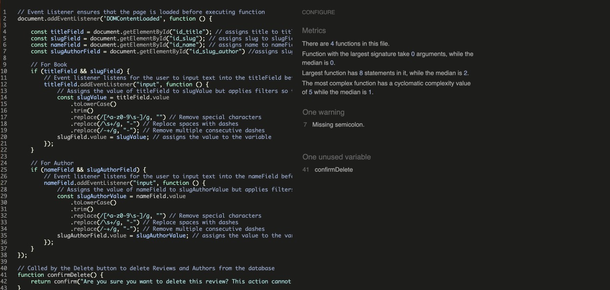

# BookWyrm Testing

[Back to the README.md file](https://github.com/SnappyJumper/BookWyrm/blob/main/README.md)

[Back to the Testing section of the README.md file](https://github.com/SnappyJumper/BookWyrm/blob/main/README.md#testing)

View the deployed site [here](https://bookwyrm-f93c738e909e.herokuapp.com/)

## Table of Contents

1. [Testing User Stories](#testing-user-stories)
2. [Code Validation](#code-validation)
3. [Accessibility](#accessibility)
4. [Tools Testing](#tools-testing)
5. [Manual Testing](#manual-testing)

***

## Testing User Stories

The missing user stories were not set for completion in the first phase release of the project.

### 1. As a logged in Site User I can create a Book Review so that I can share it with other Site Users

* A login feature was provided so Users can login to their own profiles.

* Once logged in a User has access to the Add Review Form and can create their own review.

* The User can then share their review on the site by saving it as published.

* The User can also save their review as a draft to return to later before publishing.

### 2. As a Site User I can edit my pre-existing Book Reviews so that I can improve its quality post publishing

* Once the User has published a review they can return any time to edit it.

* The User gets brought to the Edit Review Form and finds it prefilled with their content ready to be edited.

* The User can then choose to publish the content once their editing is complete or save it as a draft to return to later. 

* Only a logged in User who owns the review can edit it.

### 3. As a Site User I can delete my published reviews which will lead to a more positive user experience.

* Once a review has been published the User can return at any time to delete it.

* Only the User who created the review can choose to delete it.

* When the authorised User decides to click delete they are prompted by the site to get confirmation before deletion.

### 4. As a logged in Site User I can create a Bio for a book Author which I can share with other Site Users

* When a User has completed registration or logged in they can access the Add Author Form and create their own author bio.

* The User can then share their author bio on the site or save it as a draft before publishing.

### 5. As a Site User I can edit my published Author Pages so I can improve their quality post-publishing.

* Once the User has published an author bio they can return at any time to edit it.

* The User gets brought to the Edit Author Form and finds it prefilled with their content ready to be edited.

* The User can then choose to publish the content once their editing is complete or save it as a draft to return to later.

* Only a logged in User who owns the author bio can edit it.

### 6. As a site User I can delete my published Author Pages which will lead to a more positive user experience

* Once an author bio has been published te User can return at any time to delete it.

* Only the User who created te author bio can choose to delete it.

* When the authorised User decides to click on delete they are prompted by the site to get confirmation before deletion.

### 13. As a registered User I would like to be able to log in and out as I please which would improve my user experience.

* A registered User can log in to the site by selecting the option in the navigation bar.

* Here the registered User can enter their account information to access their account.

* Once logged in the options in the navigation bar cange and the User can access the log out option.

* Here they are prompted by the page to confirm they wish to logout by pressing a sign out button.

* Once pressed the User is signed out again.

### 14. As a logged in User I would like to see that I am logged in and be able to perform additional functions as a logged in User, this would improve my user experience and my interactions with the site.

* Once the User is logged in they are redirected to the home page where a sign in confirmation displays at the top of the page.

* The User will now see their username displayed as logged in at the top of each page.

* Once logged in the User has access to create, edit and delete their own reviews and author bios.

### 15. As a User I wouls like to be given the opportunity to register to the site , so that I can begin creating my own content and interact with the site more.

* An unregistered User can see an option within the navigation bar which allows them to access the sign up page.

* Here the unregistered User can fill in a form to secure an account on the site.

* Once they have created their account the User has access to create, edit and delete their own reviews and author bios.

## Code Validation

### HTML

The [W3C Markup Validator](https://validator.w3.org/) service was used to validate the HTML code of the project.

You'll find the validations for each page in the table below:
Page | Initial Validation | After Corrections (If applicable)
--- | --- | ---
Home |  | N/A
Reviews |  | N/A
Authors |  | N/A
Review |  | 
Author Bio |  | 
Add Review |   | Corrections were not required as these validation errors are with the summernote package and I cannot access them to change them.
Add Author |   | Corrections were not required as these validation errors are with the summernote package and I cannot access them to change them.
Edit Review |   | Corrections were not required as these validation errors are with the summernote package and I cannot access them to change them.
Edit Author |   | Corrections were not required as these validation errors are with the summernote package and I cannot access them to change them.
Signup |  | 
Login |  | N/A
Sign Out |  | N/A
Custom 404 |  | 

### CSS

The [W3C CSS Validator](https://jigsaw.w3.org/css-validator/) was used to validate the css in my Styles.css sheet.

My CSS passed the validator check with no warnings

### Python

Pylint was used continuously during the project to help detect syntax errors in the project. 

[CI Python Linter](https://pep8ci.herokuapp.com/) was then used to ensure Python code was fully validated. The results of the validation can be seen in the table below.

File | Initial Validation | After Corrections (if applicable)
--- | --- | ---
asig |  | N/A
settings |  | N/A
urls (project level) | _before.png) | _after.png)
wsgi |  | N/A
0001_initial |  | N/A
0002_author_status |  | N/A
admin |  | 
apps |  | N/A
forms |  | 
models |  | 
urls (app level) | _before.png) | _after.png)
views |  | 

### JavaScript

[JSHints JavaScript Code Quality Tool](https://jshint.com/) was used to validate the projects JavaScript code.

A small syntax error was found and deleted.

## Accessibility

Lighthouse in [Chrome DevTools](https://developer.chrome.com/docs/devtools/) was used to confirm that colors and fonts used throughout the site were readable and User friendly to all. Results can be seen in the report below.

### Lighthouse Reports

Page | Report |
| --- | --- |
| Home |  |
| Reviews |  |
| Authors |  |
| Review |  |
| Author Bio |  |
| Add Review |  |
| Add Author |  |
| Edit Review |  |
| Edit Author |  |
| Signup |  |
| Login |  |
| Sign Out |  |
| Custom 404 |  |

## Tools Testing

### [Chrome DevTools](https://developer.chrome.com/docs/devtools/)

Chrome DevTools was used throughout the development of the project for modifying and setting the HTML and CSS used.

### Responsiveness

[Chrome DevTools](https://developer.chrome.com/docs/devtools/) was used to test the responsiveness of the project across a range of different screen sizes.

## Manual Testing

### Browser Compatibility

Browser | Outcome | Pass/Fail | 
--- | --- | --- |
Google Chrome | No appearance, responsiveness nor functionality issues.| Pass |
Safari | No appearance, responsiveness nor functionality issues. | Pass |
Mozilla Firefox | No responsiveness nor functionality issues.| Pass |
Microsoft Edge | No appearance, responsiveness nor functionality issues. | Pass |

### Device Compatibility

Device |Outcome | Pass/Fail
--- | --- | --- |
Macbook Pro | No appearance, responsiveness nor functionality issues. | Pass |
OnePlus 10 Pro | No appearance, responsiveness nor functionality issues. | Pass |
iPhone 15 | No appearance, responsiveness nor functionality issues. | Pass |
iPad 6th Gen | No appearance, responsiveness nor functionality issues. | Pass |
Dell Aspire V | No appearance, responsiveness nor functionality issues. | Pass |

### Test Results

#### General

<table border="1" cellspacing="0" cellpadding="5">
    <thead>
        <tr>
            <th colspan="2">Feature</th>
            <th>Users</th>
            <th>Test</th>
            <th>Outcome</th>
            <th>Pass/Fail</th>
        </tr>
    </thead>
    <tbody>
        <tr>
            <td rowspan="7">Navigation Bar</td>
            <td>Main logo link</td>
            <td>All</td>
            <td>Clicking redirects to the Home page.</td>
            <td>Works as expected.</td>
            <td>Pass</td>
        </tr>
        <tr>
            <td>Home link</td>
            <td>All</td>
            <td>Clicking redirects to the Home page. Active link highlighted.</td>
            <td>Works as expected.</td>
            <td>Pass</td>
        </tr>
        <tr>
            <td>Reviews link</td>
            <td>All</td>
            <td>Clicking redirects to the Reviews page. Active link highlighted.</td>
            <td>Works as expected.</td>
            <td>Pass</td>
        </tr>
        <tr>
            <td>Authors link</td>
            <td>All</td>
            <td>Clicking redirects to the Authors page. Active link highlighted.</td>
            <td>Works as expected.</td>
            <td>Pass</td>
        </tr>
        <tr>
            <td>Login link</td>
            <td>Unregistered</td>
            <td>Clicking redirects to the Login Page. Active link highlighted.</td>
            <td>Works as expected.</td>
            <td>Pass</td>
        </tr>
        <tr>
            <td>Sign Up link</td>
            <td>Unregistered</td>
            <td>Clicking redirects to the Sign Up page. Active link highlighted.</td>
            <td>Works as expected.</td>
            <td>Pass</td>
        </tr>
        <tr>
            <td>Sign Out link</td>
            <td>Registered</td>
            <td>Clicking redirects to the Sign Out page. Active link highlighted.</td>
            <td>Works as expected.</td>
            <td>Pass</td>
        </tr>
    </tbody>
</table>

#### Home Page

<table border="1" cellspacing="0" cellpadding="5">
    <thead>
        <tr>
            <th colspan="2">Feature</th>
            <th>Users</th>
            <th>Test</th>
            <th>Outcome</th>
            <th>Pass/Fail</th>
        </tr>
    </thead>
    <tbody>
        <tr>
            <td rowspan="3">Welcome Section</td>
            <td>Title and Description</td>
            <td>All</td>
            <td>Displays a welcome title and engaging description about the site.</td>
            <td>Content and styling appear as expected.</td>
            <td>Pass</td>
        </tr>
        <tr>
            <td>CTA for Unregistered Users</td>
            <td>Unregistered</td>
            <td>Displays buttons prompting login or registration.</td>
            <td>Buttons and links function correctly.</td>
            <td>Pass</td>
        </tr>
        <tr>
            <td>CTA for Registered Users</td>
            <td>Registered</td>
            <td>Displays buttons encouraging interaction with reviews/authors.</td>
            <td>Buttons and links function correctly.</td>
            <td>Pass</td>
        </tr>
        <tr>
            <td rowspan="2">Featured Lists</td>
            <td>Reviews</td>
            <td>All</td>
            <td>Displays 3 featured reviews with relevant details and links.</td>
            <td>Layout and links function correctly.</td>
            <td>Pass</td>
        </tr>
        <tr>
            <td>Authors</td>
            <td>All</td>
            <td>Displays 4 featured authors with relevant details and links.</td>
            <td>Layout and links function correctly.</td>
            <td>Pass</td>
        </tr>
    </tbody>
</table>

#### Reviews Page

<table border="1" cellspacing="0" cellpadding="5">
    <thead>
        <tr>
            <th colspan="2">Feature</th>
            <th>Users</th>
            <th>Test</th>
            <th>Outcome</th>
            <th>Pass/Fail</th>
        </tr>
    </thead>
    <tbody>
        <tr>
            <td rowspan="2">Reviews List</td>
            <td>Published Reviews</td>
            <td>All</td>
            <td>Displays paginated reviews with titles linking to detailed pages.</td>
            <td>Layout and links work as expected.</td>
            <td>Pass</td>
        </tr>
        <tr>
            <td>Drafts</td>
            <td>Registered</td>
            <td>Displays drafts visible only to their author. Titles link to drafts.</td>
            <td>Works as expected for drafts and permissions.</td>
            <td>Pass</td>
        </tr>
    </tbody>
</table>

#### Authors Page

<table border="1" cellspacing="0" cellpadding="5">
    <thead>
        <tr>
            <th colspan="2">Feature</th>
            <th>Users</th>
            <th>Test</th>
            <th>Outcome</th>
            <th>Pass/Fail</th>
        </tr>
    </thead>
    <tbody>
        <tr>
            <td rowspan="2">Authors List</td>
            <td>Published Bios</td>
            <td>All</td>
            <td>Displays paginated bios with names linking to detailed pages.</td>
            <td>Layout and links work as expected.</td>
            <td>Pass</td>
        </tr>
        <tr>
            <td>Drafts</td>
            <td>Registered</td>
            <td>Displays drafts visible only to their creator. Names link to drafts.</td>
            <td>Works as expected for drafts and permissions.</td>
            <td>Pass</td>
        </tr>
    </tbody>
</table>

#### Book Review Page

<table border="1" cellspacing="0" cellpadding="5">
    <thead>
        <tr>
            <th colspan="2">Feature</th>
            <th>Users</th>
            <th>Test</th>
            <th>Outcome</th>
            <th>Pass/Fail</th>
        </tr>
    </thead>
    <tbody>
        <tr>
            <td rowspan="3">Review Display</td>
            <td>Rich Text Content</td>
            <td>All</td>
            <td>Displays the review content in a rich text format.</td>
            <td>Rich text displays correctly, including formatting.</td>
            <td>Pass</td>
        </tr>
        <tr>
            <td>Author Details</td>
            <td>All</td>
            <td>Displays the review's author details.</td>
            <td>Author's name and review date display as expected.</td>
            <td>Pass</td>
        </tr>
        <tr>
            <td>Rating</td>
            <td>All</td>
            <td>Displays the user's rating for the book out of 5.</td>
            <td>Rating displays correctly with appropriate formatting.</td>
            <td>Pass</td>
        </tr>
        <tr>
            <td rowspan="2">Owner Options</td>
            <td>Edit Button</td>
            <td>Registered (Owner)</td>
            <td>Displays an edit button for the review's creator.</td>
            <td>Button redirects to the Edit Review form for the instance.</td>
            <td>Pass</td>
        </tr>
        <tr>
            <td>Delete Button</td>
            <td>Registered (Owner)</td>
            <td>Displays a delete button for the review's creator.</td>
            <td>Button triggers confirmation prompt before deletion.</td>
            <td>Pass</td>
        </tr>
    </tbody>
</table>

### Author Bio Page

<table border="1" cellspacing="0" cellpadding="5">
    <thead>
        <tr>
            <th colspan="2">Feature</th>
            <th>Users</th>
            <th>Test</th>
            <th>Outcome</th>
            <th>Pass/Fail</th>
        </tr>
    </thead>
    <tbody>
        <tr>
            <td rowspan="3">Bio Display</td>
            <td>Rich Text Content</td>
            <td>All</td>
            <td>Displays the author's biography in a rich text format.</td>
            <td>Rich text displays correctly, including formatting.</td>
            <td>Pass</td>
        </tr>
        <tr>
            <td>Author Details</td>
            <td>All</td>
            <td>Displays the author's date of birth, nationality, and genre.</td>
            <td>Details display correctly with appropriate formatting.</td>
            <td>Pass</td>
        </tr>
        <tr>
            <td>Favorite Book</td>
            <td>All</td>
            <td>Displays the author's favorite book.</td>
            <td>Favorite book displays as expected.</td>
            <td>Pass</td>
        </tr>
        <tr>
            <td rowspan="2">Owner Options</td>
            <td>Edit Button</td>
            <td>Registered (Owner)</td>
            <td>Displays an edit button for the bio's creator.</td>
            <td>Button redirects to the Edit Author form for the instance.</td>
            <td>Pass</td>
        </tr>
        <tr>
            <td>Delete Button</td>
            <td>Registered (Owner)</td>
            <td>Displays a delete button for the bio's creator.</td>
            <td>Button triggers confirmation prompt before deletion.</td>
            <td>Pass</td>
        </tr>
    </tbody>
</table>

### Add Review Page

<table border="1" cellspacing="0" cellpadding="5">
    <thead>
        <tr>
            <th colspan="2">Feature</th>
            <th>Users</th>
            <th>Test</th>
            <th>Outcome</th>
            <th>Pass/Fail</th>
        </tr>
    </thead>
    <tbody>
        <tr>
            <td rowspan="3">Form Fields</td>
            <td>Input Fields</td>
            <td>Registered</td>
            <td>Displays fields for entering the review title, genre, rating, and review content.</td>
            <td>Fields display with correct input types and validation.</td>
            <td>Pass</td>
        </tr>
        <tr>
            <td>Date Picker</td>
            <td>Registered</td>
            <td>Displays a date picker for selecting the book's publication date.</td>
            <td>Date picker works as expected on all devices.</td>
            <td>Pass</td>
        </tr>
        <tr>
            <td>Foreign Key Relations</td>
            <td>Registered</td>
            <td>Verifies that the review is linked to an existing author in the Author Model and logged-in user (review_author)</td>
            <td>Review correctly references the associated author without errors.</td>
            <td>Pass</td>
        </tr>
        <tr>
            <td>Submit Button</td>
            <td>N/A</td>
            <td>Registered</td>
            <td>Displays a button for submitting the form.</td>
            <td>Button submits the form and redirects to the Reviews page upon success.</td>
            <td>Pass</td>
        </tr>
    </tbody>
</table>

### Edit Review Page

<table border="1" cellspacing="0" cellpadding="5">
    <thead>
        <tr>
            <th colspan="2">Feature</th>
            <th>Users</th>
            <th>Test</th>
            <th>Outcome</th>
            <th>Pass/Fail</th>
        </tr>
    </thead>
    <tbody>
        <tr>
            <td rowspan="2">Form Fields</td>
            <td>Pre-filled Fields</td>
            <td>Registered (Owner)</td>
            <td>Displays fields pre-filled with the existing review details.</td>
            <td>Fields display pre-filled content as expected.</td>
            <td>Pass</td>
        </tr>
        <tr>
            <td>Date Picker</td>
            <td>Registered (Owner)</td>
            <td>Displays a pre-filled date picker for the book's publication date.</td>
            <td>Date picker works as expected on all devices.</td>
            <td>Pass</td>
        </tr>
        <tr>
            <td>Submit Button</td>
            <td>N/A</td>
            <td>Registered (Owner)</td>
            <td>Displays a button for submitting the edited form.</td>
            <td>Button submits the form and updates the review instance.</td>
            <td>Pass</td>
        </tr>
    </tbody>
</table>

### Delete Review/Author Prompts

Delete Review Prompt
<table border="1" cellspacing="0" cellpadding="5">
    <thead>
        <tr>
            <th>Feature</th>
            <th>Users</th>
            <th>Test</th>
            <th>Outcome</th>
            <th>Pass/Fail</th>
        </tr>
    </thead>
    <tbody>
        <tr>
            <td>Delete Confirmation</td>
            <td>Registered (Owner)</td>
            <td>Displays a confirmation prompt before deletion.</td>
            <td>Prompt prevents accidental deletion; review is deleted after confirmation.</td>
            <td>Pass</td>
        </tr>
    </tbody>
</table>

Delete Author Prompt
<table border="1" cellspacing="0" cellpadding="5">
    <thead>
        <tr>
            <th>Feature</th>
            <th>Users</th>
            <th>Test</th>
            <th>Outcome</th>
            <th>Pass/Fail</th>
        </tr>
    </thead>
    <tbody>
        <tr>
            <td>Delete Confirmation</td>
            <td>Registered (Owner)</td>
            <td>Displays a confirmation prompt before deletion.</td>
            <td>Prompt prevents accidental deletion; author bio is deleted after confirmation.</td>
            <td>Pass</td>
        </tr>
    </tbody>
</table>

### Add Author Page

<table border="1" cellspacing="0" cellpadding="5">
    <thead>
        <tr>
            <th colspan="2">Feature</th>
            <th>Users</th>
            <th>Test</th>
            <th>Outcome</th>
            <th>Pass/Fail</th>
        </tr>
    </thead>
    <tbody>
        <tr>
            <td rowspan="4">Form Fields</td>
            <td>Input Fields</td>
            <td>Registered</td>
            <td>Displays fields for entering the author's name, nationality, genre, and favorite book.</td>
            <td>Fields display with correct input types and validation.</td>
            <td>Pass</td>
        </tr>
        <tr>
            <td>Date Picker</td>
            <td>Registered</td>
            <td>Displays a date picker for selecting the author's date of birth.</td>
            <td>Date picker works as expected on all devices.</td>
            <td>Pass</td>
        </tr>
        <tr>
            <td>Rich Text Editor</td>
            <td>Registered</td>
            <td>Displays a rich text editor for writing the author's bio.</td>
            <td>Editor allows formatting and works as expected.</td>
            <td>Pass</td>
        </tr>
        <tr>
            <td>Foreign Key Relations</td>
            <td>Registered</td>
            <td>Verifies that the author entry is linked to the logged-in user (posted_by).</td>
            <td>The author entry correctly references the logged-in user as the creator without errors.</td>
            <td>Pass</td>
        </tr>
        <tr>
            <td>Submit Button</td>
            <td>N/A</td>
            <td>Registered</td>
            <td>Displays a button for submitting the form.</td>
            <td>Button submits the form and redirects to the Authors page upon success.</td>
            <td>Pass</td>
        </tr>
    </tbody>
</table>

### Edit Author Page

<table border="1" cellspacing="0" cellpadding="5">
    <thead>
        <tr>
            <th colspan="2">Feature</th>
            <th>Users</th>
            <th>Test</th>
            <th>Outcome</th>
            <th>Pass/Fail</th>
        </tr>
    </thead>
    <tbody>
        <tr>
            <td rowspan="3">Form Fields</td>
            <td>Pre-filled Fields</td>
            <td>Registered (Owner)</td>
            <td>Displays fields pre-filled with the existing author details.</td>
            <td>Fields display pre-filled content as expected.</td>
            <td>Pass</td>
        </tr>
        <tr>
            <td>Date Picker</td>
            <td>Registered (Owner)</td>
            <td>Displays a pre-filled date picker for the author's date of birth.</td>
            <td>Date picker works as expected on all devices.</td>
            <td>Pass</td>
        </tr>
        <tr>
            <td>Rich Text Editor</td>
            <td>Registered (Owner)</td>
            <td>Displays a rich text editor pre-filled with the author's bio.</td>
            <td>Editor allows editing and retains formatting.</td>
            <td>Pass</td>
        </tr>
        <tr>
            <td>Submit Button</td>
            <td>N/A</td>
            <td>Registered (Owner)</td>
            <td>Displays a button for submitting the edited form.</td>
            <td>Button submits the form and updates the author instance.</td>
            <td>Pass</td>
        </tr>
    </tbody>
</table>

### Custom 404 Page

<table border="1" cellspacing="0" cellpadding="5">
    <thead>
        <tr>
            <th>Feature</th>
            <th>Users</th>
            <th>Test</th>
            <th>Outcome</th>
            <th>Pass/Fail</th>
        </tr>
    </thead>
    <tbody>
        <tr>
            <td>Custom Error Design</td>
            <td>All</td>
            <td>Displays a themed 404 error page when a page is not found.</td>
            <td>Error page shows dragon-themed design and offers navigation back to the homepage.</td>
            <td>Pass</td>
        </tr>
    </tbody>
</table>

### Login Page

<table border="1" cellspacing="0" cellpadding="5">
    <thead>
        <tr>
            <th>Feature</th>
            <th>Users</th>
            <th>Test</th>
            <th>Outcome</th>
            <th>Pass/Fail</th>
        </tr>
    </thead>
    <tbody>
        <tr>
            <td>Form Fields</td>
            <td>All</td>
            <td>Displays username and password fields for login.</td>
            <td>Fields accept input and validate user credentials correctly.</td>
            <td>Pass</td>
        </tr>
        <tr>
            <td>CSRF Token</td>
            <td>All</td>
            <td>Form includes a CSRF token for security.</td>
            <td>Submission without the token results in an error; token is present in the form.</td>
            <td>Pass</td>
        </tr>
        <tr>
            <td>Login Button</td>
            <td>All</td>
            <td>Displays a button to submit login credentials.</td>
            <td>Clicking the button logs in users with valid credentials and redirects to the homepage.</td>
            <td>Pass</td>
        </tr>
        <tr>
            <td>Login Failure</td>
            <td>All</td>
            <td>Displays an error message for invalid login attempts.</td>
            <td>Users are informed about invalid credentials.</td>
            <td>Pass</td>
        </tr>
        <tr>
            <td>Responsive Design</td>
            <td>All</td>
            <td>Form is responsive across devices.</td>
            <td>Form adjusts and works as expected on mobile, tablet, and desktop.</td>
            <td>Pass</td>
        </tr>
    </tbody>
</table>

### Sign Up Page

<table border="1" cellspacing="0" cellpadding="5">
    <thead>
        <tr>
            <th>Feature</th>
            <th>Users</th>
            <th>Test</th>
            <th>Outcome</th>
            <th>Pass/Fail</th>
        </tr>
    </thead>
    <tbody>
        <tr>
            <td>Form Fields</td>
            <td>Unregistered</td>
            <td>Displays fields for username, email, and password creation.</td>
            <td>Form accepts input and validates new user data correctly.</td>
            <td>Pass</td>
        </tr>
        <tr>
            <td>CSRF Token</td>
            <td>Unregistered</td>
            <td>Form includes a CSRF token for security.</td>
            <td>Submission without the token results in an error; token is present in the form.</td>
            <td>Pass</td>
        </tr>
        <tr>
            <td>Signup Button</td>
            <td>Unregistered</td>
            <td>Displays a button to submit signup details.</td>
            <td>Button creates a new user and redirects to the homepage upon success.</td>
            <td>Pass</td>
        </tr>
        <tr>
            <td>Validation Errors</td>
            <td>Unregistered</td>
            <td>Displays validation errors for duplicate usernames, weak passwords, etc.</td>
            <td>Errors are displayed in a user-friendly manner.</td>
            <td>Pass</td>
        </tr>
        <tr>
            <td>Responsive Design</td>
            <td>Unregistered</td>
            <td>Form is responsive across devices.</td>
            <td>Form adjusts and works as expected on mobile, tablet, and desktop.</td>
            <td>Pass</td>
        </tr>
    </tbody>
</table>

### Log Out Page

<table border="1" cellspacing="0" cellpadding="5">
    <thead>
        <tr>
            <th>Feature</th>
            <th>Users</th>
            <th>Test</th>
            <th>Outcome</th>
            <th>Pass/Fail</th>
        </tr>
    </thead>
    <tbody>
        <tr>
            <td>Logout Functionality</td>
            <td>Registered</td>
            <td>Redirects users to the homepage after logging out.</td>
            <td>Users are successfully logged out and can no longer access restricted content.</td>
            <td>Pass</td>
        </tr>
        <tr>
            <td>Confirmation</td>
            <td>Registered</td>
            <td>Displays a message confirming the logout action.</td>
            <td>Confirmation message is displayed as expected.</td>
            <td>Pass</td>
        </tr>
        <tr>
            <td>Redirect Behavior</td>
            <td>Registered</td>
            <td>Redirects users to the home page after logout.</td>
            <td>Redirect works seamlessly across devices.</td>
            <td>Pass</td>
        </tr>
    </tbody>
</table>

### Messages

<table border="1" cellspacing="0" cellpadding="5">
    <thead>
        <tr>
            <th>Feature</th>
            <th>Users</th>
            <th>Test</th>
            <th>Outcome</th>
            <th>Pass/Fail</th>
        </tr>
    </thead>
    <tbody>
        <tr>
            <td>SUCCESS Message Display</td>
            <td>All</td>
            <td>
                Triggers a success message (e.g., after adding, editing, or deleting an entry) 
                and checks that it displays correctly in the `base.html` template.
            </td>
            <td>
                Message is displayed with a green background and correct styling. Message content 
                is visible, and it can be dismissed manually.
            </td>
            <td>Pass</td>
        </tr>
        <tr>
            <td>ERROR Message Display</td>
            <td>All</td>
            <td>
                Triggers an error message (e.g., unauthorized access, form validation failure) 
                and checks that it displays correctly in the `base.html` template.
            </td>
            <td>
                Message is displayed with a yellow background and correct styling. Message content 
                is visible, and it can be dismissed manually.
            </td>
            <td>Pass</td>
        </tr>
    </tbody>
</table>

